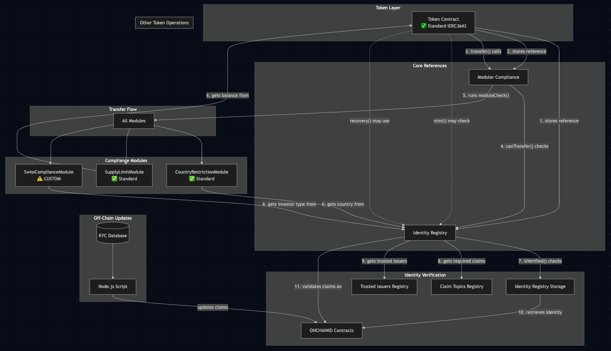

## Accurate ERC-3643 Architecture with Explained Connections



## Detailed Connection Explanations

### Token Contract References (Connections 1-2)
The Token contract stores TWO references per the ERC-3643 standard:
- **Identity Registry**: Used for mint(), burn(), recovery operations
- **Modular Compliance**: Used for ALL transfer checks

### Primary Transfer Flow (Connections 3-5)
```solidity
// In Token.sol
function transfer(address to, uint256 amount) {
    // Connection 3: Token asks Compliance
    require(compliance.canTransfer(msg.sender, to, amount), "Not compliant");
    
    // Connection 4: Inside canTransfer(), Compliance checks Identity Registry
    // Connection 5: Compliance also runs all modules
    
    _transfer(msg.sender, to, amount);
}
```

### Module Data Access (Connection 6)
**Note**: Modules don't directly access ONCHAINID
```solidity
// CountryRestrictionModule gets data from IdentityRegistry
function moduleCheck(address from, address to, uint256 value) {
    IToken token = IToken(msg.sender);
    IIdentityRegistry registry = token.identityRegistry();
    
    // Module asks IdentityRegistry for cached country data
    uint16 country = registry.investorCountry(to);
    // NOT accessing ONCHAINID directly
    
    return allowedCountries[country];
}
```

### Identity Verification Flow (Connections 7-11)
When IdentityRegistry.isVerified() is called:
```solidity
function isVerified(address user) {
    // 7. Get identity contract from storage
    IIdentity identity = identityStorage.storedIdentity(user);
    
    // 8. Get required claims
    uint256[] memory topics = claimTopicsRegistry.getClaimTopics();
    
    // 9. Get trusted issuers
    address[] memory issuers = trustedIssuersRegistry.getTrustedIssuers();
    
    // 10-11. Validate claims on ONCHAINID
    for (each required claim) {
        identity.getClaim(claimTopic); // Accesses ONCHAINID
    }
}
```

## Contract Deployment - 95% Standard ERC-3643

### 1. Token Contract - UNMODIFIED

Use T-REX Token contract as-is:

```solidity
// Standard IERC3643 Token - NO HEDERA MODIFICATIONS
contract Token is IERC3643 {
    IIdentityRegistry public identityRegistry; // For mint/burn/recovery
    ICompliance public compliance;              // For transfer checks
    
    // Standard ERC-3643 transfer
    function transfer(address to, uint256 amount) 
        public 
        override 
        returns (bool) 
    {
        require(!paused, "Token paused");
        require(!frozen[msg.sender], "Sender frozen");
        require(!frozen[to], "Recipient frozen");
        
        // Token ONLY asks compliance for permission
        require(
            compliance.canTransfer(msg.sender, to, amount),
            "Transfer not compliant"
        );
        
        _transfer(msg.sender, to, amount);
        
        // Notify compliance of completed transfer
        compliance.transferred(msg.sender, to, amount);
        
        // Standard ERC-20 event (no HCS needed)
        emit Transfer(msg.sender, to, amount);
        
        return true;
    }
    
    // Direct identity registry use for other operations
    function mint(address to, uint256 amount) public onlyAgent {
        // May check identityRegistry.isVerified(to) directly
        require(identityRegistry.isVerified(to), "Recipient not verified");
        _mint(to, amount);
    }
}
```

### 2. ModularCompliance Contract - UNMODIFIED

```solidity
// Standard ModularCompliance - NO MODIFICATIONS NEEDED
contract ModularCompliance is ICompliance {
    IToken public token;
    IComplianceModule[] public modules;
    
    // Called by Token.transfer()
    function canTransfer(
        address _from,
        address _to,
        uint256 _value
    ) external view override returns (bool) {
        // Compliance gets identity registry from token
        IIdentityRegistry identityRegistry = token.identityRegistry();
        
        // Check both parties are verified
        if (!identityRegistry.isVerified(_from)) return false;
        if (!identityRegistry.isVerified(_to)) return false;
        
        // Run all compliance modules
        for (uint256 i = 0; i < modules.length; i++) {
            // Each module gets data from identityRegistry
            if (!modules[i].moduleCheck(_from, _to, _value)) {
                return false;
            }
        }
        
        return true;
    }
}
```

### 3. All Registry Contracts - UNMODIFIED

Use standard T-REX registry contracts exactly as-is:

```solidity
// Standard IdentityRegistry - NO MODIFICATIONS
contract IdentityRegistry is IIdentityRegistry {
    IIdentityRegistryStorage public identityStorage;
    IClaimTopicsRegistry public topicsRegistry;
    ITrustedIssuersRegistry public issuersRegistry;
    
    // Cached data for gas optimization
    mapping(address => uint16) public investorCountry;
    
    // Called by ModularCompliance
    function isVerified(address _userAddress) 
        external 
        view 
        override 
        returns (bool) 
    {
        // Get identity from storage
        IIdentity identity = identityStorage.storedIdentity(_userAddress);
        if (address(identity) == address(0)) return false;
        
        // Check all required claims exist and are valid
        // This is where ONCHAINID is actually accessed
        return validateClaims(identity);
    }
}
```

Other standard registries:
- **ClaimTopicsRegistry**: Defines which claims are required
- **TrustedIssuersRegistry**: Defines who can issue claims  
- **IdentityRegistryStorage**: Maps addresses to ONCHAINID contracts
```

### 4. Standard Compliance Modules - UNMODIFIED

**Important**: Modules get data from IdentityRegistry, NOT directly from ONCHAINID:

```solidity
// Standard CountryRestrictionModule - NO MODIFICATIONS
contract CountryRestrictionModule is IComplianceModule {
    mapping(uint16 => bool) public allowedCountries;
    
    function moduleCheck(
        address _from,
        address _to,
        uint256 _value
    ) external view override returns (bool) {
        // Get token and registry references
        // (Implementation detail: via ModularCompliance)
        IModularCompliance compliance = IModularCompliance(msg.sender);
        IToken token = compliance.token();
        IIdentityRegistry registry = token.identityRegistry();
        
        // Module gets CACHED country from IdentityRegistry
        // NOT directly from ONCHAINID!
        uint16 country = registry.investorCountry(_to);
        
        return allowedCountries[country];
    }
}
```

Other standard modules work similarly:
- **SupplyLimitModule**: Checks token.totalSupply()
- **TimeRestrictionsModule**: Checks time-based rules
- **MaxBalanceModule**: Checks token.balanceOf()
```

### 5. CUSTOM Swiss Compliance Modules (NEW AUR development)

**Important**: Even custom modules access data through IdentityRegistry, not ONCHAINID directly:

```solidity
// CUSTOM MODULE - not audited
// Example data, to be confirmed and adapted case by case
contract SwissComplianceModule is IComplianceModule {
    mapping(address => bool) public nonQualifiedInvestors;
    uint256 public nonQualifiedCount;
    uint256 public constant MAX_NON_QUALIFIED = 10;
    uint256 public constant RETAIL_LIMIT = 2_000_000 * 10**18; // 2M CHF
    
    // Custom claim topic for investor type
    uint256 public constant INVESTOR_TYPE_TOPIC = 3;
    
    function moduleCheck(
        address _from,
        address _to,
        uint256 _value
    ) external view override returns (bool) {
        IToken token = IToken(msg.sender);
        IIdentityRegistry registry = token.identityRegistry();
        
        // For investor type, we need to check the actual ONCHAINID
        // because it's not cached in IdentityRegistry
        IIdentityRegistryStorage storage = registry.identityStorage();
        IIdentity identity = storage.storedIdentity(_to);
        
        // Only here do we access ONCHAINID - through the registry chain
        bytes32 claimId = keccak256(abi.encode(trustedIssuer, INVESTOR_TYPE_TOPIC));
        bytes memory claimData = identity.getClaim(claimId).data;
        uint256 investorType = abi.decode(claimData, (uint256));
        
        if (investorType == RETAIL_INVESTOR) {
            // Swiss 10 non-qualified investor rule
            if (!nonQualifiedInvestors[_to]) {
                if (nonQualifiedCount >= MAX_NON_QUALIFIED) {
                    return false;
                }
            }
            
            // Swiss 2M CHF retail limit
            uint256 newBalance = token.balanceOf(_to) + _value;
            if (newBalance > RETAIL_LIMIT) {
                return false;
            }
        }
        
        return true;
    }
}
```

## Off-Chain KYC Updates (Prototype Approach)

Instead of on-chain oracle contracts, use simple backend scripts. Later to be replaced by onchain modifier.

```javascript
// updateClaims.js - Run by your backend when KYC status changes
const { ethers } = require('ethers');

// Connect to Hedera via standard JSON-RPC
const provider = new ethers.JsonRpcProvider('https://mainnet.hashio.io/api');
const issuerWallet = new ethers.Wallet(process.env.ISSUER_PRIVATE_KEY, provider);

async function updateUserClaims(userAddress, kycData) {
    // Get user's ONCHAINID contract
    const identityRegistry = new ethers.Contract(
        IDENTITY_REGISTRY_ADDRESS,
        IDENTITY_REGISTRY_ABI,
        provider
    );
    
    const identityAddress = await identityRegistry.identity(userAddress);
    const identityContract = new ethers.Contract(
        identityAddress,
        ONCHAINID_ABI,
        issuerWallet // Issuer signs the transaction
    );
    
    // Prepare claim data
    const claimTopics = {
        KYC: 1,
        COUNTRY: 2,
        INVESTOR_TYPE: 3,
        AML: 4,
        SWISS_QUALIFIED: 5
    };
    
    // Add/update claims
    const claims = [
        { topic: claimTopics.KYC, data: ethers.toUtf8Bytes(kycData.kycLevel) },
        { topic: claimTopics.COUNTRY, data: ethers.toUtf8Bytes(kycData.country) },
        { topic: claimTopics.INVESTOR_TYPE, data: ethers.toUtf8Bytes(kycData.investorType) },
        { topic: claimTopics.AML, data: ethers.toUtf8Bytes(kycData.amlStatus) },
        { topic: claimTopics.SWISS_QUALIFIED, data: ethers.toUtf8Bytes(kycData.swissQualified) }
    ];
    
    for (const claim of claims) {
        const signature = await createClaimSignature(claim);
        
        await identityContract.addClaim(
            claim.topic,
            1, // scheme
            issuerWallet.address,
            signature,
            claim.data,
            "" // uri
        );
    }
}

// Batch update for gas efficiency
async function batchUpdateClaims() {
    const updates = await getKYCUpdatesFromDatabase();
    
    for (const update of updates) {
        await updateUserClaims(update.address, update.kycData);
        await markAsProcessed(update.id);
    }
}

// Run every hour
setInterval(batchUpdateClaims, 3600000);
```

## Deployment Using Standard T-REX Factory

```javascript
// Deploy using standard T-REX factory - NO MODIFICATIONS
const factory = await ethers.getContractAt("ITREXFactory", T_REX_FACTORY_ADDRESS);

const tokenDetails = {
    owner: deployer.address,
    name: "Swiss Real Estate Token",
    symbol: "SRE",
    decimals: 18,
    irs: "0x0", // Creates new Identity Registry Storage
    ONCHAINID: "0x0", // Creates token's ONCHAINID
    irAgents: [agent.address],
    tokenAgents: [agent.address],
    complianceModules: [
        // Standard modules
        countryModule.address,
        supplyModule.address,
        timeModule.address,
        maxBalanceModule.address
    ],
    complianceSettings: []
};

const claimDetails = {
    claimTopics: [1, 2, 3, 4, 5], // KYC, Country, Type, AML, Swiss
    issuers: [issuerWallet.address], // Your backend's issuer address
    issuerClaims: [[1, 2, 3, 4, 5]]
};

// Deploy entire suite
const tx = await factory.deployTREXSuite(
    "salt_swiss_rwa_001",
    tokenDetails,
    claimDetails
);

// Add Swiss modules after deployment
const compliance = await ethers.getContractAt("ModularCompliance", complianceAddress);
await compliance.addModule(swissComplianceModule.address); // Only custom part
```

### Summary Transfer Flow
1. User calls Token.transfer()
2. Token calls Compliance.canTransfer()
3. Compliance calls IdentityRegistry.isVerified() for both parties
4. Compliance calls each Module.moduleCheck()
5. Modules query IdentityRegistry for cached data
6. If all return true, transfer proceeds

This architecture should be 100% compliant with the official ERC-3643 documentation.

## Conclusion

Notes on Hedera (tbc):
- **No HCS needed** - Standard events work perfectly
- **No Hedera account mapping** - Use standard Ethereum addresses
- **Maximum portability** - Could deploy on any other EVM chain without changes
